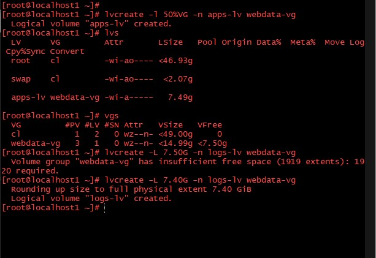
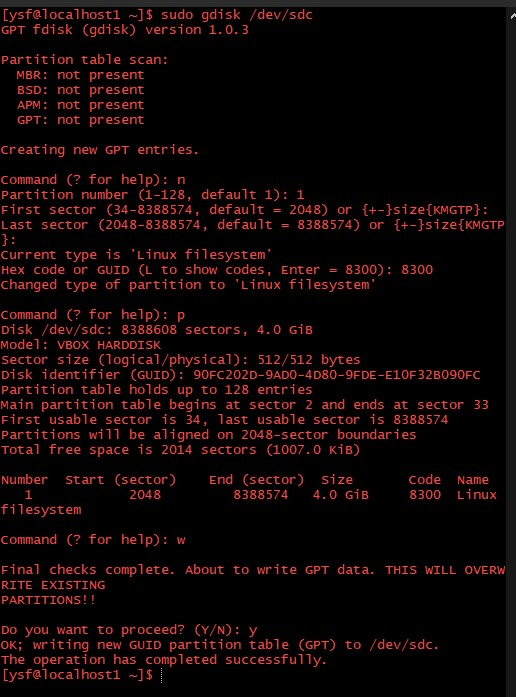
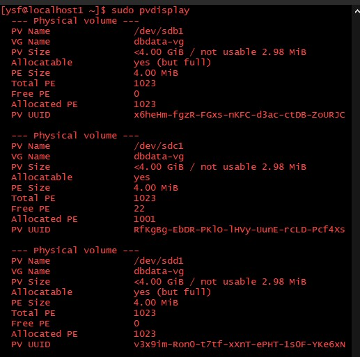
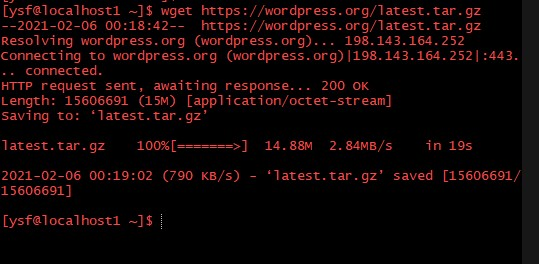
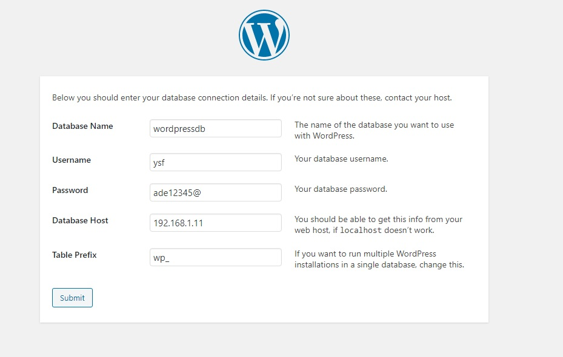

# Web Solution With Wordpress
### WordPress is a free and open-source content management system (CMS) written in PHP and paired with a MySQL or MariaDB database. Features include a plugin architecture and a template system, referred to within WordPress as Themes. WordPress was originally created as a blog-publishing system but has evolved to support other web content types including more traditional mailing lists and forums, media galleries, membership sites, learning management systems (LMS) and online stores. WordPress is used by more than 60 million websites,including 39% of the top 10 million websites as of January 2021. WordPress is one of the most popular content management system solutions in use. WordPress has also been used for other application domains, such as pervasive display systems (PDS).

### To function, WordPress has to be installed on a web server, either part of an Internet hosting service like ***WordPress.com*** or a computer running the software package ***WordPress.org*** in order to serve as a network host in its own right. A local computer may be used for single-user testing and learning purposes.

<p>

### Generally web, or mobile solutions are implemented based on what is called the Three-tier Architecture.


## Presentation / Client Tier
* This tier consists of application clients that access a Java EE server and that are usually located on a different machine from the server. The clients make requests to the server. The server processes the requests and returns a response back to the client.

## Application / Business Tier
* This tier contains the functional business logic which drives an application's core capabilities. It's often written in Java, . NET, C#, Python, C++, etc. 

## Data Tier
* This tier is the base of a web database application. It comprises of the database/data storage system and data access layer. Understanding system requirements, choosing database-tier software, designing databases, and building the tier are the first steps in successful web database application development.

## In this project, We will have the hands-on experience that showcases Three-tier Architecture while also ensuring that the disks used to store files on the Linux servers are adequately partitioned and managed through programs such as gdisk and LVM respectively. The following steps will be followed to achieve our aim and objectives of this project.

## Step 1 — Prepare the Web Server
* We added three disks to our sever and we need to view and familiarise ourselves with the disk configuration on the server by running the command
```
# df -h
```


* We need to create a single partition on each of the 3 disks we added to our server using the command;
```
# gdisk /dev/sdb
```


```
# gdisk /dev/sdc
```


```
# gdisk /dev/sdd
```


* We will use the command below to view the newly configured partition on each of the 3 disks
```
# lsblk
```


* We use this command to check for available storage for Logical Volume Manager (LVM)
```
# lvmdiskscan
```


* We need to mark the disks as LVM physical volumes with the command
```
# pvcreate /dev/sdb1 /dev/sdc1 /dev/sdd1
```


* We need to add the PVs to a volume group. We will Name the VG webdata-vg
```
# vgcreate webdata-vg /dev/sdb1 /dev/sdc1 /dev/sdd1
```


* We need to create 2 logical volumes. *apps-lv* (We use 50% of the PV size), and logs-lv will have the remaining space of the PV size. **NOTE:** *apps-lv* will be used to store data for the Website while, *logs-lv* will be used to store data for logs.
```
# lvcreate -l 50%VG -n apps-lv webdata-vg
```
```
# lvcreate -L 7.40G -n logs-lv webdata-vg
```


* We need to confirm the entire setup by exploring the below commands to view the complete setup - VG, PV, and LV
```
# vgdisplay
```


```
# pvdisplay
```


```
# lvdisplay
```


* To view logical volume summary
```
# lvs 
```


* To view the specified block devices
```
# lsblk 
```


* We need  to format the logical volume with Ext4 filesystem
```
# mkfs.ext4 /dev/webdata-vg/apps-lv
```

```
# mkfs.ext4 /dev/webdata-vg/logs-lv
```


* We need to create */var/www/html* directory to store our website files
```
# mkdir -p /var/www/html
```

* We need to create */home/recovery/logs* to store backup of log data
```
# mkdir -p /home/recovery/logs
```

* We need to Mount */var/www/html* on *apps-lv* logical volume
```
# mount /dev/webdata-vg/apps-lv /var/www/html/
```

* We need to backup all the files in the log directory */var/log* into */home/recovery/logs* (This is required before mounting the file system)
```
# rsync -r /var/log/ /home/recovery/logs/
```

* We need to Mount */var/log* on *logs-lv* logical volume
```
# mount /dev/webdata-vg/logs-lv /var/log/
```

* We need to restore log files back into */var/log* directory.
```
# cp -r /home/recovery/logs/.* /var/log
```

* We need to update the */etc/fstab* file so that the mount configuration will persist upon restart of the server.


## Step 2 — Prepare the Database Server
* We added three disks to our database sever and we need to view and familiarise ourselves with the disk configuration on the server by running the command
```
$ df -h
```


* We need to create a single partition on each of the 3 disks we added to our server using the command
```
$ sudo gdisk /dev/sdb
```


```
$ sudo gdisk /dev/sdc
```


```
$ sudo gdisk /dev/sdd
```


* We will use the command below to view the newly configured partition on each of the 3 disks
```
$ sudo lsblk
```


* We use this command to check for available storage for Logical Volume Manager (LVM)
```
$ sudo lvmdiskscan
```


* We need to mark the disks as LVM physical volumes with the command
```
$ sudo pvcreate /dev/sdb1 /dev/sdc1 /dev/sdd1
```


* We need to add the PVs to a volume group.We will Name the VG *dbdata-vg*
```
$ sudo vgcreate dbdata-vg /dev/sdb1 /dev/sdc1 /dev/sdd1
```


* We need to create 2 logical volumes. *db-lv* (We use 50% of the PV size), and logs-lv will have the remaining space of the PV size. **NOTE:** *db-lv* will be used to store data for the Website while, *logs-lv* will be used to store data for logs.
```
$ sudo lvcreate -L 5.8VG -n db-lv dbdata-vg
```
```
$ sudo lvreate -L 6.1 -n logs-lv dbdata-vg
```


* We need to confirm the entire setup by exploring the below commands to view the complete setup - VG, PV, and LV
```
$ sudo vgdisplay
```


```
$ sudo pvdisplay
```


```
$ sudo lvdisplay
```


* To view logical volume summary
```
$ sudo lvs
```


* To view the specified block devices
```
$ sudo lsblk
```


* We need  to format the logical volume with Ext4 filesystem
```
$ sudo mkfs.ext4 /dev/dbdata-vg/db-lv
```

```
$ sudo mkfs.ext4 /dev/dbdata-vg/logs-lv
```


* We need to create */db* directory to store our database files
```
$ sudo mkdir /db
```

* We need to create */home/recovery/logs* to store backup of log data
```
$ sudo mkdir -p /home/recovery/logs
```

* We need to Mount */db* on *db-lv* logical volume
```
$ sudo sudo mount /dev/dbdata-vg/db-lv /db
```

* We need to backup all the files in the log directory */var/log* into */home/recovery/logs* (This is required before mounting the file system)
```
$ sudo rsync -r /var/log/ /home/recovery/logs/
```

* We need to Mount */var/log* on *logs-lv* logical volume
```
$ sudo mount /dev/dbdata-vg/logs-lv /var/log
```

* We need to restore log files back into */var/log* directory.
```
$ sudo cp -r /home/recovery/logs/.* /var/log
```

* We need to update the */etc/fstab* file so that the mount configuration will persist upon restart of the server.

## Step 3 — Install Wordpress on our Web Server
* We need to install the utilities to be used wordpress which is php with the command
```
$ sudo yum -y install php-mysqlnd php-fpm httpd php-json
```


* We need to download WordPress and get it ready for install.
```
$ wget https://wordpress.org/latest.tar.gz
```


* We need to extract the file we just downloaded
```
$ tar -zxvf latest.tar.gz
```

* We need to move our extracted wordpress to our */var/www/html* directory
```
$ sudo cp -r wordpress /var/www/html
```

* We need to change the ownership of the directory
```
$ sudo chown -R apache:apache /var/www/html/wordpress
```

* We need to change permissions and change file SELinux security context
```
$ sudo chcon -t httpd_sys_rw_content_t /var/www/html/wordpress -R
```

## Step 4 — Install MySQL on our Database Server
* We need to install MySQL with the command.
```
$ sudo yum -y install mariadb mariadb-server
```

* We need to configure our installation with the command
```
$ sudo mysql_secure_installation
```

* We login into our MySQL database with the command
```
$ mysql -u root - p
```

* We need to create a database for our wordpress to access.
```
MariaDB > create database wordpress;
```


## Step 5 — We need to Configure wordpress to connect to remote database.
* After the above steps we can now browse to configure our wordpress website
```
http:\\localhost/wordpress
```




## I got an error trying to connect to the database


## I corrected it by setting the SELinux configuration with the follow commands.
```
$ sudo setsebool -P httpd_can_network_connect 1
```

```
$ sudo setsebool -P httpd_can_network_connect_db 1
```

```
$ sudo semanage fcontext -a -t httpd_sys_content_t "/var/www/html(/.*)?"
```

```
$ sudo semanage fcontext -a -t httpd_log_t "/var/log/httpd/logs(/.*)?"
```

## We need to restart out apache webserver.
```
$ sudo systemctl restart httpd
```

## Then it got connected to the database and we can Install our wordpress


## Our wordpress website is up and running


# CREDITS
### https://en.wikipedia.org/wiki/WordPress

### https://www.google.com.ng/search?q=Three-tier+Architecture.&tbm=isch&ictx=1&tbs=rimg:Cemdpbnzt2KhIgjpnaW587dioSoSCemdpbnzt2KhEV2Ni9n4i-sn&hl=en-US&sa=X&ved=2ahUKEwie4_vTo9HuAhUUKRQKHYa4BCcQiRx6BAgAEAQ&biw=1349&bih=667

### https://www.oreilly.com/library/view/web-database-applications/0596000413/ch01s04.html#:~:text=The%20database%20tier%20is%20the,successful%20web%20database%20application%20development.

### https://www.jinfonet.com/resources/bi-defined/3-tier-architecture-complete-overview/#:~:text=Application%20Tier%2D%20The%20application%20tier,system%20and%20data%20access%20layer.

### https://docs.oracle.com/cd/E19226-01/820-7759/gcrla/index.html#:~:text=The%20client%20tier%20consists%20of,response%20back%20to%20the%20client.


